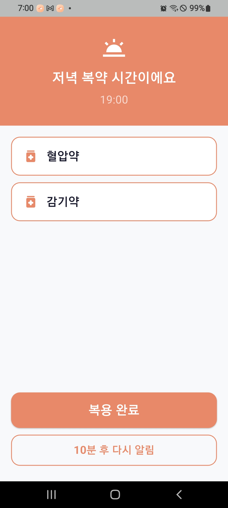
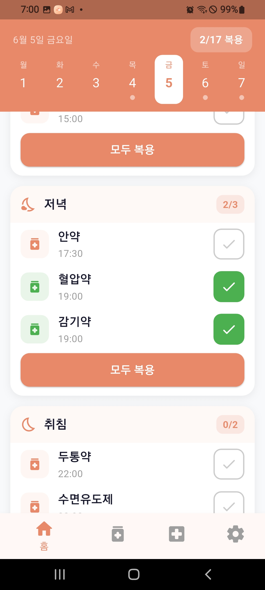
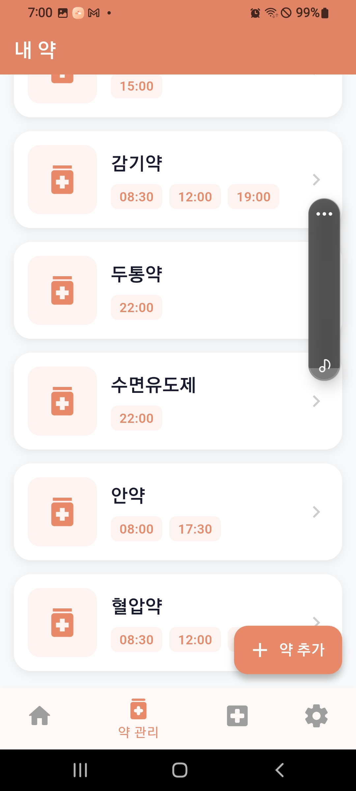
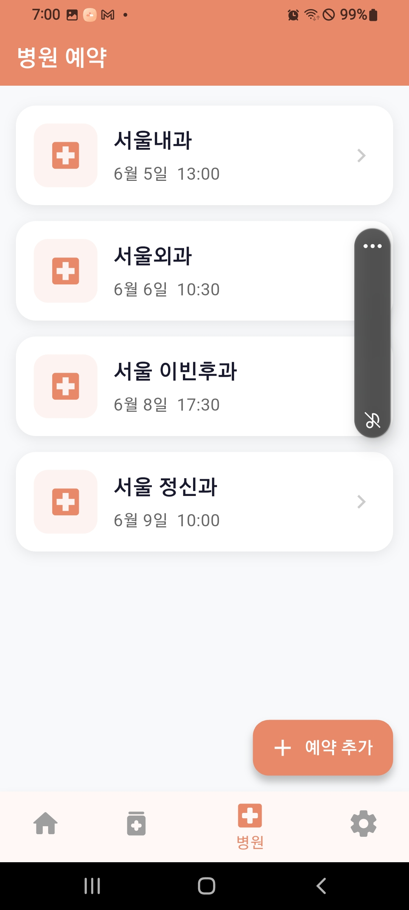
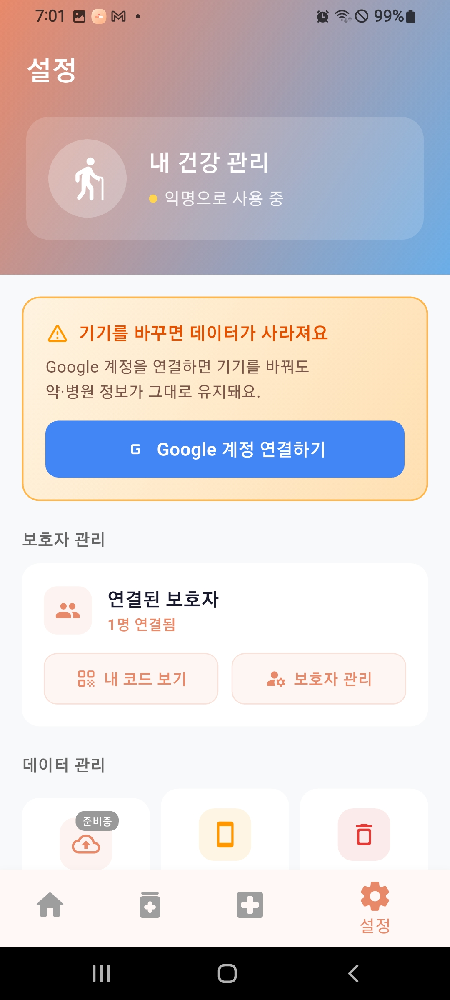
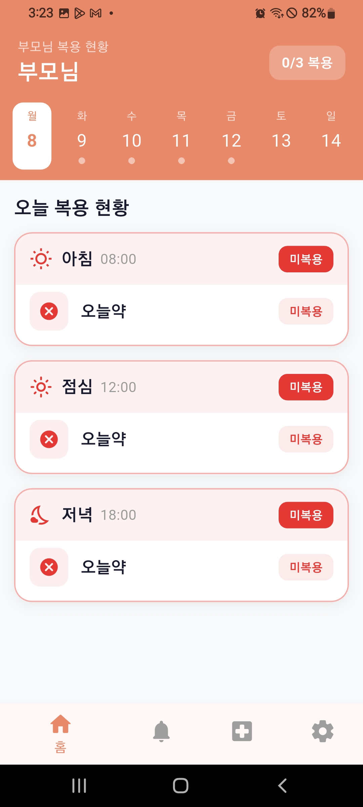
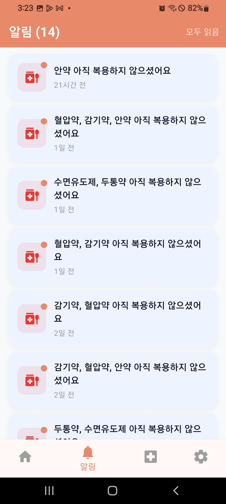
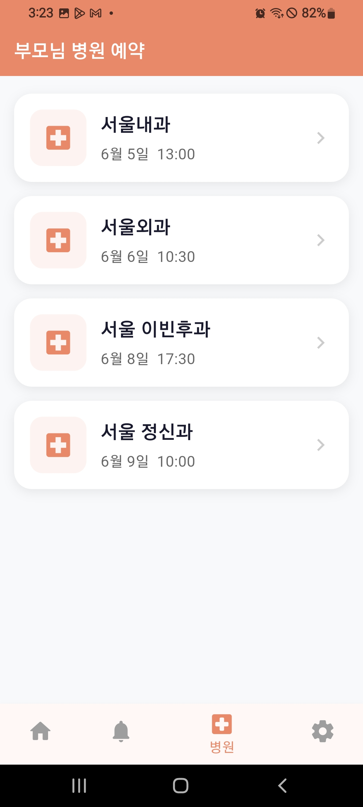
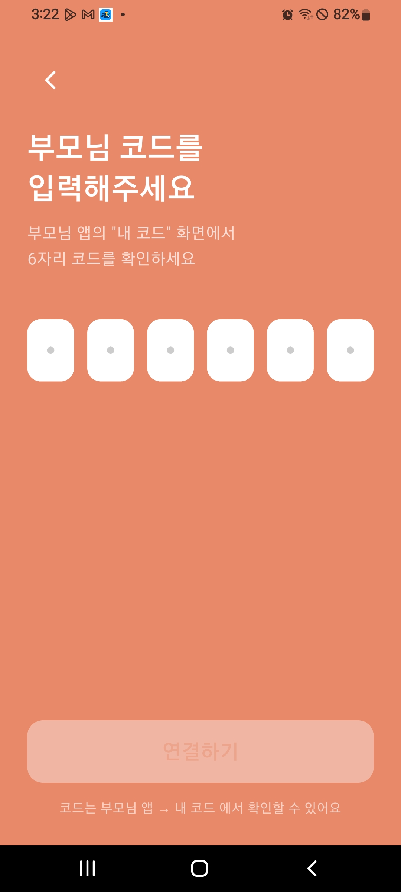

# 약봄

> 어르신의 약 복용과 병원 일정을 관리하고, 떨어져 사는 가족이 실시간으로 현황을 확인하는 Flutter 앱

어르신은 **큰 글씨·큰 버튼**으로 약을 챙기고, 자녀는 **부모님의 복용 현황과 미복용 알림**을 원격으로 받습니다.
취업 포트폴리오 겸 실사용을 목표로 개발했습니다.

---

## 스크린샷

### 어르신 모드

| 풀스크린 알람 | 홈 (복용 현황) | 약 관리 | 병원 예약 | 설정 |
|:---:|:---:|:---:|:---:|:---:|
|  |  |  |  |  |

> 약 먹을 시간에 화면이 꺼져 있어도 **잠금화면 위로 전체 화면 알람**이 떠 "복용 완료" 한 번으로 처리됩니다.

### 가족 모드

| 홈 (부모 현황) | 미복용 알림 | 병원 조회 | 코드 연결 |
|:---:|:---:|:---:|:---:|
|  |  |  |  |

> 부모님이 약을 거르면 **자녀에게 자동으로 미복용 알림**이 갑니다 (같은 시간대 약은 한 번에 묶어서).

---

## 주요 기능

### 어르신 모드
- **홈** — 주간 달력 + 아침/점심/저녁/취침 시간대별 복용 현황
- **약 관리** — 약 등록·수정·삭제, 시간대별 복용 시간 설정, 먹는약/바르는약 구분
- **풀스크린 알람** — 복용 시간에 잠금화면 위로 전체 화면 알람, 미복용 시 +10분 리마인더
- **병원 예약** — 예약 등록 및 2시간 전 알림
- **설정** — 알림 ON/OFF, 보호자 연결 코드, Google 계정 연동, 데이터 초기화

### 가족 모드
- **홈** — 부모님의 오늘 복용 현황 (시간대별)
- **미복용 알림** — 부모님이 약을 거르면 20분 후 자동 푸시 (같은 시간대 약 묶음 발송)
- **병원 조회** — 부모님의 병원 예약 확인
- **코드 연결** — 6자리 코드로 부모님 계정과 연결

---

## 기술 스택

| 분류 | 사용 기술 |
|------|-----------|
| 프레임워크 | Flutter 3.x (Android 우선) |
| 인증 | Firebase Auth (익명 로그인 + Google 연동) |
| 데이터베이스 | Cloud Firestore |
| 푸시 알림 | Firebase Cloud Messaging (FCM) |
| 로컬 알림 | flutter_local_notifications (풀스크린 인텐트) |
| 서버 로직 | Firebase Cloud Functions + Cloud Tasks (Node.js) |
| 세션 유지 | shared_preferences |
| 네이티브 | Kotlin (MainActivity — 화면 제어, 배터리 최적화 면제) |

### 프로젝트 구조

계층형(Layered) + 기능별 폴더 구조.

```
lib/
├── main.dart        앱 진입점 · 테마 · 알람 라우팅
├── models/          데이터 모델 (medicine, appointment, log ...)
├── services/        로직 · 외부 연동 (firestore, notification, auth, prefs)
├── screens/         화면 (senior/, family/)
├── widgets/         재사용 위젯 (카드, 달력)
└── utils/           유틸 (시간/슬롯 계산, KST)
```

---

## Firestore 구조

```
users/{uid}
  ├── code: "A3K9X2"
  ├── linkedSeniorUid: ""
  ├── linkedFamilyUids: []
  ├── fcmToken: ""
  └── missedDoseNotificationEnabled: true   # 가족 미복용 알림 수신 설정

codes/{code}
  ├── ownerUid: ""
  └── createdAt: Timestamp   # 1시간 후 만료

users/{uid}/medicines/{medicineId}
  ├── name: "혈압약"
  ├── times: ["08:00", "21:00"]
  ├── type: "oral" | "topical"   # 먹는약 / 바르는약
  ├── startDate: Timestamp
  └── endDate: Timestamp | null

users/{uid}/medicine_logs/{logId}
  ├── medicineId: ""
  ├── medicineName: "혈압약"
  ├── scheduledTime: Timestamp   # KST 기준
  ├── taken: false
  ├── takenAt: Timestamp | null
  └── notified: false            # 보호자 FCM 발송 여부 (중복 방지)

users/{uid}/appointments/{appointmentId}
  ├── hospitalName: "서울내과"
  ├── date: Timestamp
  └── memo: ""

users/{uid}/notifications/{notificationId}
  ├── medicineName: "혈압약, 감기약"
  ├── isRead: false
  └── createdAt: Timestamp
```

---

## 실행

```bash
flutter pub get
flutter run
```

> Firebase 연동 시 `google-services.json` 및 `lib/firebase_options.dart` 필요

---

## 문서

- [작업 이력 (CHANGELOG)](CHANGELOG.md) — 날짜별 개발 기록
- [개발 현황 (DEVELOPMENT)](DEVELOPMENT.md) — 기능별 구현 상태

---

## 라이선스

개인 포트폴리오 프로젝트입니다. 무단 배포를 금합니다.
